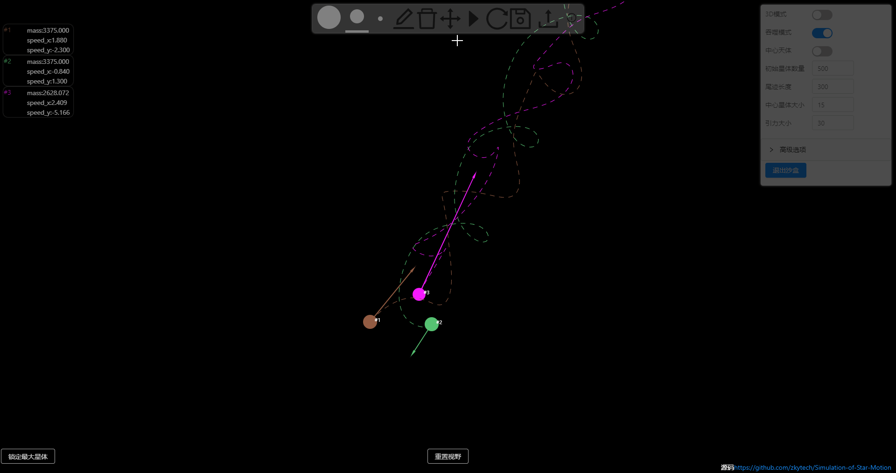

# 星体运动模拟

>## 使用方法

`yarn install`

`yarn start`

[在线预览](http://119.29.128.164:27879/stars/index.html)

已针对移动端进行适配，支持使用手机进行所有操作。

打开页面，默认是随机初始化一定数量的星体，星体在引力的相互作用下进行运动。
也可以选择在沙盒中创造属于你自己的宇宙。

沙盒：设置面板->沙盒

在项目文件夹`预设沙盒`中提供了预设沙盒数据。
- 导出沙盒数据: 开启沙盒->沙盒上方工具栏->点击保存按钮
- 导入沙盒数据: 开启沙盒->沙盒上方工具栏->点击导入按钮

3D模式：设置面板->3D模式

>## 相关技术

2D模型的绘制就是单纯的canvas绘图

3D模型的绘制使用的是threejs，其本身是对WebGL的一个封装。

>## 效果演示

3D模式

沙盒

沙盒编辑

视野锁定

>## TODO

- [X] 2D模型
- [X] 完善控制面板
- [X] 添加自定义星体（沙盒）
- [X] 3D模型
- [X] 导入/导出沙盒数据（JSON）
- [X] 步长可控（用于调整精度）
- [X] 移动端适配
- [X] 视角锁定指定星体
- [ ] 增加多种类沙盒星体预设
- [ ] AR模式（虽然AR.js能实现，但这种形式的AR我无法接受，而WebARonARkit & WebARonARCore 现在谷歌已经停止了开发，且正在开发替代项目，等谷歌的新项目出来了再做这个AR模式。）
